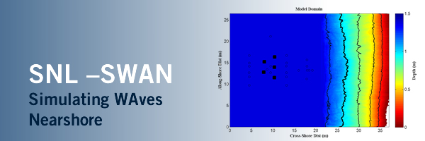

.. toctree::
   :maxdepth: 4
   :hidden:

   release_notes.rst
   getting_started.rst
   online_forum.rst
   publications.rst
   license.rst

Project Overview
====================

SNL-SWAN (Sandia National Laboratories – Simulating WAves Nearshore) is an open source wave energy converter (WEC) array simulation tool. The code is a modification of the open source code, `SWAN (Simulating WAves Nearshore) <http://swanmodel.sourceforge.net/>`_ developed by `TU Delft <http://www.swan.tudelft.nl/>`_. The SNL-SWAN code includes the addition of a WEC Module which improves how SWAN accounts for power performance of WECs and the effects on the wave field. For more information on the implementation and application of SNL-SWAN, please refer to the `SNL-SWAN website <http://snl-waterpower.github.io/SNL-SWAN/>`_.  SNL-SWAN user questions should be posted on the `SNL-SWAN online forum <https://github.com/SNL-WaterPower/SNL-SWAN/issues>`_. The SNL-SWAN project is funded by the U.S. Department of Energy’s Wind and Water Power Technologies Office.

Principal Developers
--------------------

* Chris Chartrand (SNL)
* Ari Posner (DOE EERE Post-Doc)

Contributors
------------

* Kelley Ruehl (SNL)
* Aaron Porter (Coast and Harbor Inc.)
* Helen Smith (University of Exeter)

.. Indices and tables
.. ======

.. * :ref:`genindex`
.. * :ref:`modindex`
.. * :ref:`search`